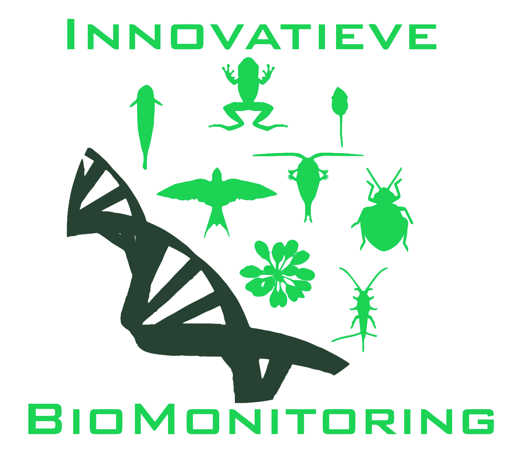
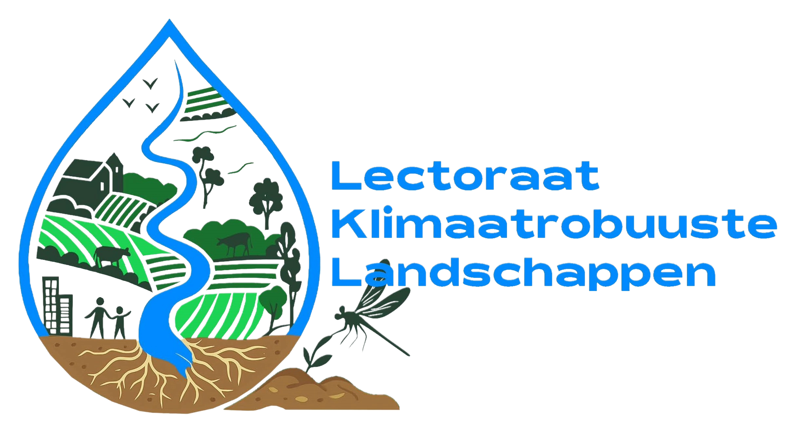

# HAS-GRASS-addons

## DESCRIPTION

This repository contains a number of GRASS addons for spatial data processing and analysis. The development of these tools has been supported, in full or in part, by various research projects. Note that although some tools originated within particular projects (see below), similar analytical challenges frequently arise across different research efforts. As a result, these tools have been developed and maintained as reusable components rather than project-specific outputs.

   

Click on a logo to get information about the project. In addition, the development would not have been possible without the awesome [GRASS community](https://grass.osgeo.org/support/community/) specifically, and the Open source community in general.