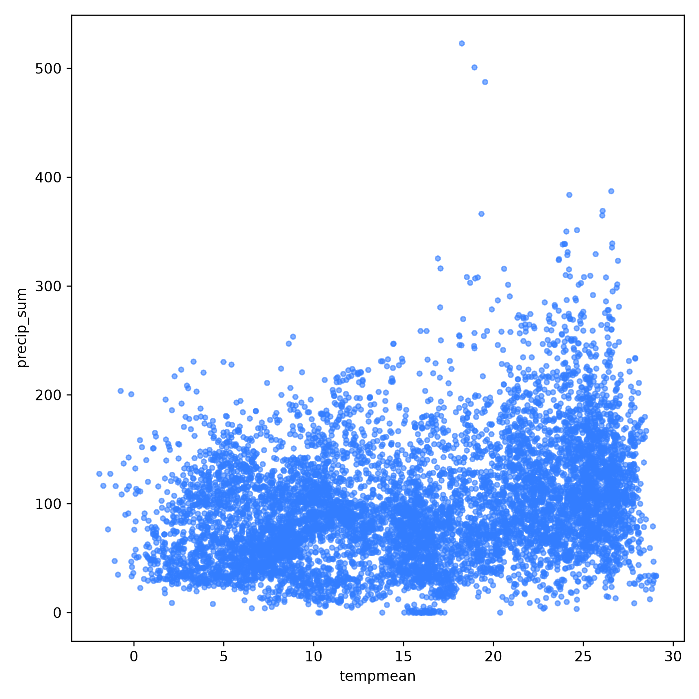
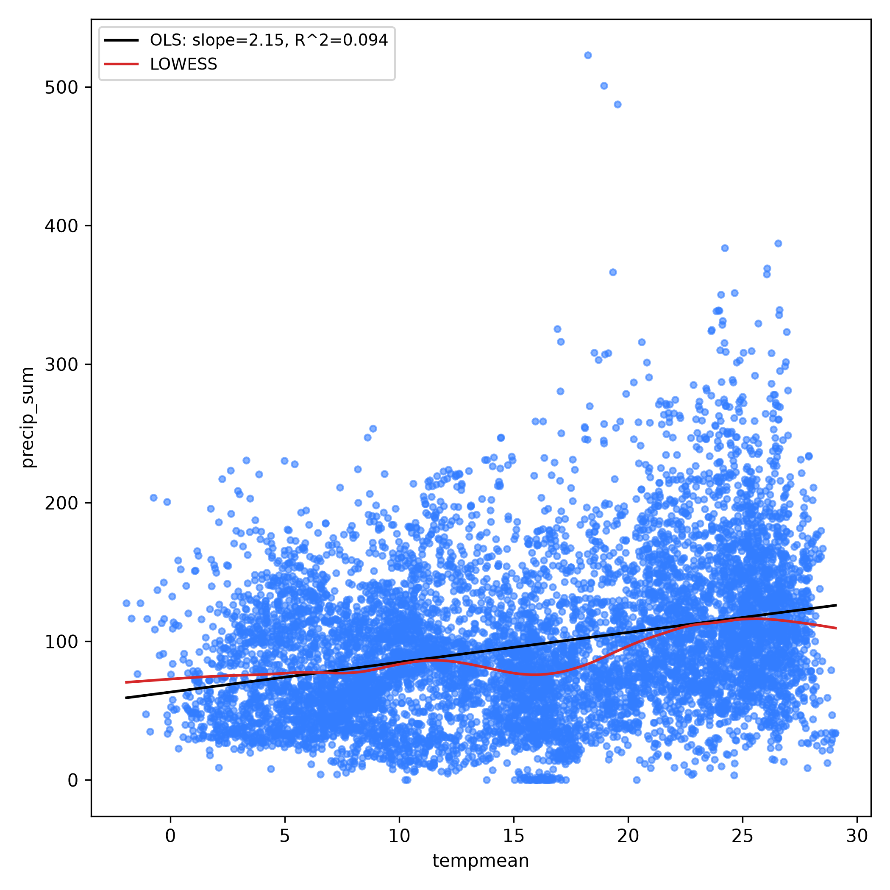
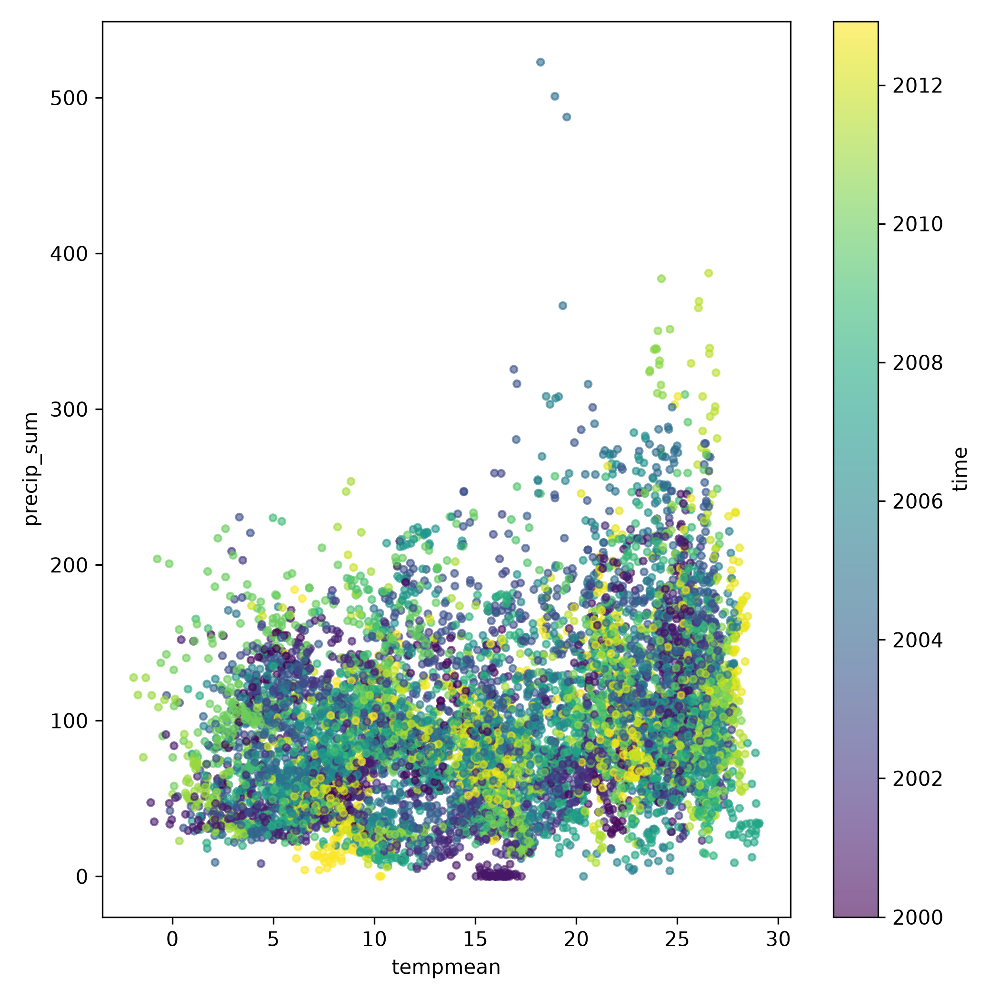

## DESCRIPTION

*t.rast.scatter* draws a **scatterplot** of the values of two space-time raster
datasets (strds) against one another. Both datasets are sampled at the same set
of points (supplied as a vector point map) at every shared timestep. Optionally,
one or more regression curves are fitted and drawn on top: an ordinary
least-squares (OLS) line, a LOWESS smoother, and/or a Generalized Additive Model
(GAM) curve.

The module can be used for exploratory analysis of the relationship between two
co-variables through time, for example a vegetation index against land surface
temperature, or rainfall against soil moisture. Internally it uses
*[t.rast.what](t.rast.what.md)* to sample both datasets at the given points
across all timesteps, pairs the two series in time, and then plots the result
with [matplotlib](https://matplotlib.org/).

### Input and sampling

The two datasets are given with **xstrds** (plotted on the x axis) and
**ystrds** (plotted on the y axis). Both must use **absolute time** (see below).

The sample locations are supplied with **points**, a vector map of points. Both
datasets are sampled at these locations for every timestep. The points are
passed straight to *[t.rast.what](t.rast.what.md)*, which samples at the
*current computational region*'s resolution.

### Absolute time only

The tool supports **absolute-time** (calendar-dated) datasets only.
Relative-time datasets are not supported because without a known time, there is
no reliable way to tell whether two relative indices refer to genuinely
comparable moments.

### Pairing the two datasets in time

The two datasets may not have identical timestamps, so the **method** option
controls how their timesteps are matched into *(x, y)* pairs. There are two
approaches.

**method=nearest** (the default) matches each map of one dataset to the
closest-in-time map of the other, within a maximum allowed time difference set
by **tolerance**. This preserves the individual observations: every paired dot
is a real sample from each dataset. The **tolerance** is a duration string such
as `1 day`, `6 hours` or `30 minutes`; a map with no counterpart inside that
window is dropped from the plot. Matching is nearest-neighbour and one-to-one.
This is a useful approach when timestamp differences are small jitter rather
than a difference in sampling design.

With the **aggregate methods** (`mean`, `median`, `sum`, `min`, `max`), both
datasets are first binned to a common **frequency** and each bin is reduced to a
single summary value, and then the per-period summaries are paired. That means
that each dot represents the period summaries. The **frequency** is a [pandas
offset
alias](https://pandas.pydata.org/docs/user_guide/timeseries.html#time-span-representation)
such as `D` (daily), `W` (weekly), `MS` (month start) or `YS` (year start).

In both cases the pairing keeps only point/time combinations where **both**
datasets have a non-null value.

### Regression curves

Three optional fits can be drawn over the scatter cloud.

**-o** adds an ordinary least-squares (OLS) regression line, reported with its
**slope**, **intercept** and **R²** (SciPy's
[linregress](https://docs.scipy.org/doc/scipy/reference/generated/scipy.stats.linregress.html)).

**-l** adds a **LOWESS** (locally weighted scatterplot smoothing) curve, a
flexible local regression that follows the data without assuming a global
functional shape (statsmodels'
[lowess](https://www.statsmodels.org/stable/generated/statsmodels.nonparametric.smoothers_lowess.lowess.html)).
Its smoothness is set with **lowess_frac**, the fraction of the data used to
estimate each local value (between 0 and 1, default 0.3); larger values give a
smoother curve.

**-g** adds a **Generalized Additive Model** (GAM) curve, a smooth spline fit
([pyGAM](https://pygam.readthedocs.io/)). It captures curved relationships
without prescribing their form.

The **-t** flag adds the fit statistics (such as the OLS slope and R²) to the
plot legend. The statistics are always printed to the terminal regardless of
this flag.

**A note on significance.** A scatterplot of two time series should be
interpreted with care. Environmental series are almost always temporally
autocorrelated. Treat the provided statistics therefore as descriptive summaries
of co-variation, not as proof of a relationship.

### Colouring the points

By default all points are drawn in a single colour, set with **color**. It
accepts a standard GRASS colour name (such as `blue`), an `R:G:B` triplet with
each component in 0-255 (such as `51:125:255`), a hex code (`#1f77b4`) or a
`tab:` name.

The **-c** flag instead colours each point by its timestep, with a colorbar
mapping colour to date. This may reveal temporal structure like a seasonal
hysteresis loop where the relationship follows a different path on the way up
than on the way down. When **-c** is set, the **color** option is ignored.

### Output

By default the scatterplot is shown in an interactive window. If **output** is
given, the plot is instead saved to that file and the image format is taken from
the file extension (`.png`, `.pdf`, `.svg`, ...). Plot appearance is controlled
by **dpi** (resolution, default 300) and **plot_dimensions** (width,height in
inches).

The **backend** option selects the matplotlib rendering backend. You rarely need
it: `Agg` is chosen automatically when writing to a file, and `WXAgg` (an
interactive window) when no output file is given. Override it only if your
system needs a different interactive backend (e.g. `TkAgg`, `Qt5Agg`).

The **csv** option additionally writes the paired *(x, y)* samples, one row per
point and timestep with their coordinates and date, so they can be replotted or
analysed in the software tool of your choice.

### Subsetting and performance

The **where** option accepts a temporal WHERE clause (as used by other `t.*`
modules) to restrict the analysis to a subset of timestamps, for example a
particular range of years.

The **nprocs** option sets the number of parallel processes used during sampling
by *[t.rast.what](t.rast.what.md)*, potentially making the module substantially
faster to run.

## NOTES

This addon requires the Python packages *numpy*, *pandas*, *scipy* and
*matplotlib*. They are all pip-installable, e.g.

```sh
pip install numpy pandas scipy matplotlib
```

A recent **pandas** (version 2.0 or newer) is required. For the optional
regression curves, you will need *statsmodels* for the LOWESS smoother (**-l**)
and *pygam* for the GAM curve (**-g**). The libraries are optional, you can run
the module without *statsmodels* or *pygam* as long as you do not request the
corresponding curve.

```sh
pip install statsmodels pygam
```
## EXAMPLES

The examples use the North Carolina mapset with climatic data time series
(nc_climate_spm_2000_2012), which you can download from the
[GRASS sample data](https://grass.osgeo.org/download/data/) page.

### Data preparation

The following is borrowed from the
[NSCU-Geoforall](https://ncsu-geoforall-lab.github.io/grass-temporal-workshop/)
tutorial. We create temporal datasets which serve as containers for the time
series. First step is to create empty datasets of type strds (space-time raster
dataset). Note, that we use absolute time.

```sh
t.create output=tempmean type=strds temporaltype=absolute title="Average temperature" description="Monthly temperature average in NC [deg C]"

t.create output=precip_sum type=strds temporaltype=absolute title="Precipitation" description="Monthly precipitation sum in NC [mm]"
```

Now we register raster maps into the space-time raster datasets we just created.
We use `g.list` to list separately temperature and precipitation maps. Note that
`g.list` lists maps alphabetically which in this case orders the maps
chronologically which is what we need. Using backticks to pass the maps directly
to t.register

```sh
t.register -i input=tempmean type=raster start=2000-01-01 increment="1 months" \
maps=`g.list type=raster pattern="*tempmean" separator=comma --quiet`

t.register -i input=precip_sum type=raster start=2000-01-01 increment="1 months" \
maps=`g.list type=raster pattern="*precip" separator=comma --quiet`
```

### Create sample points

The module samples both datasets at a set of points. Here we generate 100 random
points across the current region with *[v.random](v.random.md)*, to be reused at
every timestep:

```sh
g.region raster=2000_01_tempmean -p

v.random output=samples npoints=100 seed=1
```

### Scatterplot of two datasets

Plot the monthly temperature against the monthly precipitation at the sample
points. Because the two datasets share the same monthly timestamps, a small
tolerance is enough to pair them:

```sh
t.rast.scatter xstrds=tempmean ystrds=precip_sum points=samples method=nearest \
tolerance=nearest frequency="5 days" output=t_rast_scatter_01.png
```

Resulting image:



### Add regression curves

To explore the form of the relationship, add an OLS line (**-o**) and a LOWESS
smoother (**-l**), and show the fit statistics in the legend with **-t**:

```sh
t.rast.scatter -olt xstrds=tempmean ystrds=precip_sum points=samples \
tolerance="5 days" output=t_rast_scatter_02.png
```

Resulting image:



### Colour the points by time

Add **-c** to colour each point by its date, which can reveal a seasonal loop in
the relationship:

```sh
t.rast.scatter -c xstrds=tempmean ystrds=precip_sum points=samples \
tolerance="5 days" output=t_rast_scatter_03.png
```

Resulting image:



### Aggregate before pairing

When you are interested in the relationship between typical per-period values
rather than between individual acquisitions, switch from nearest-in-time
matching to aggregation. Here both datasets are binned to year start (`YS`) and
reduced to their annual mean before pairing:

```sh
t.rast.scatter -ot xstrds=tempmean ystrds=precip_sum points=samples \
method=mean frequency=YS output=t_rast_scatter_04.png
```

Each dot now represents one point in one year, with the x and y values being
that year's mean temperature and mean precipitation at that location.

### Restrict to a subset of years

The **where** option restricts the analysis to a subset of timestamps, for
example the years 2005 to 2010:

```sh
t.rast.scatter -ol xstrds=tempmean ystrds=precip_sum points=samples \
tolerance="5 days" where="start_time >= '2005-01-01' and start_time <
'2011-01-01'" \ output=t_rast_scatter_05.png
```

## SEE ALSO

*[t.rast.stl](t.rast.stl.md), [t.rast.line](t.rast.line.md),
[t.rast.what](t.rast.what.md), [t.rast.univar](t.rast.univar.md)*

## REFERENCES

- Cleveland, W. S. (1979). Robust Locally Weighted Regression and Smoothing
  Scatterplots. *Journal of the American Statistical Association*, 74(368),
  829–836.
- Local regression. (2026). In *Wikipedia*
  [Wikipedia local regression article](https://en.wikipedia.org/wiki/Local_regression).
- statsmodels. (2025). *Statsmodels* (Version 0.14.6) [Python]
  [statsmodels repository](https://github.com/statsmodels/statsmodels/).
- Servén, D., & Brummitt, C. (2018). pyGAM: Generalized Additive Models in
  Python. *Zenodo*. [pyGAM documentation](https://pygam.readthedocs.io/).

## AUTHOR

[Paulo van Breugel](https://ecodiv.earth),
[Innovative Biomonitoring](https://www.has.nl/en/research/professorships/innovative-bio-monitoring-professorship/)
and
[Climate-robust Landscapes](https://www.has.nl/en/research/professorships/climate-robust-landscapes-professorship/)
research groups at the [HAS green academy](https://has.nl)
